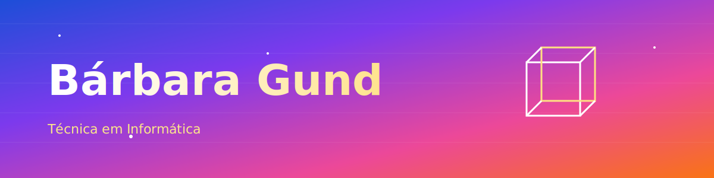

---

### 👩‍💻 Sobre mim

Estudante de **Técnico em Informática** pelo Senac RS (2024–2026), em transição de carreira para a área de Tecnologia da Informação.

Ao longo da formação venho desenvolvendo conhecimentos em manutenção de computadores, redes, sistemas operacionais, banco de dados e desenvolvimento web. Antes de migrar para TI, atuo como cuidadora infantil — experiência que me ensinou a resolver problemas rapidamente, ter paciência e me comunicar com clareza, habilidades que levo comigo para o atendimento e suporte ao usuário.

- 🎓 Cursando Técnico em Informática — Senac RS.
- 🎯 Em busca da primeira oportunidade na área da Ti.
- 🌱 Aprimorando conhecimentos em redes, banco de dados, manutenção de computadores, lógica de programação, banco de dados e desenvolvimento web.

---

### 🛠️ Tecnologias e Ferramentas

---

📫 **Aberta a oportunidades de estágio e primeiro emprego em Técnico de TI**

